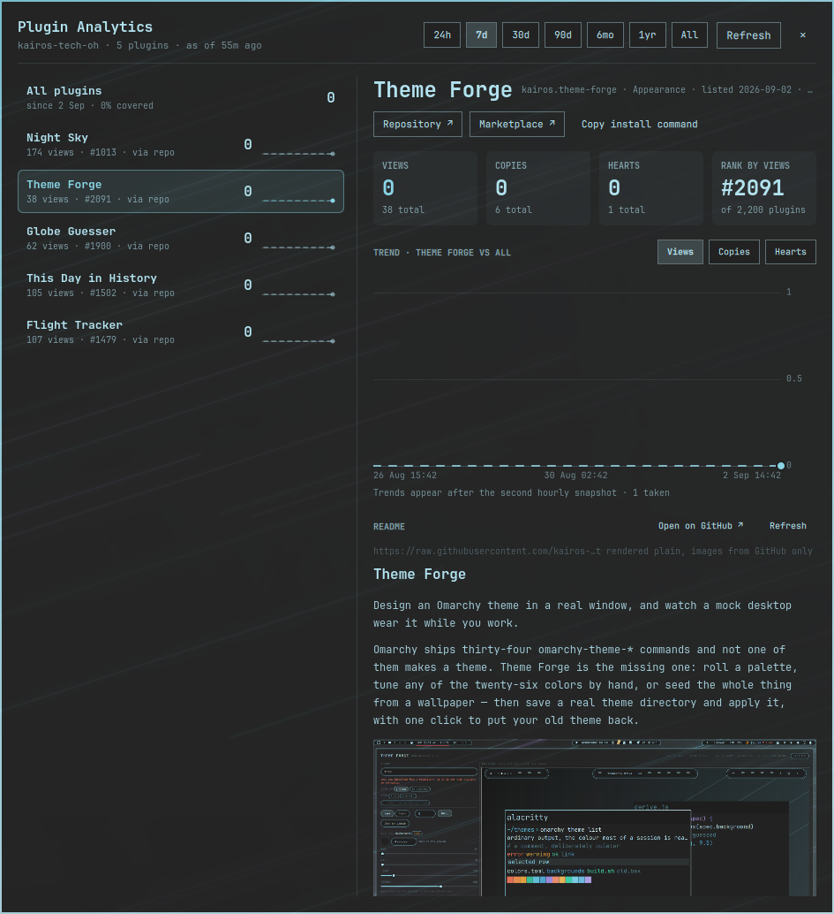

# Plugin Analytics

Developer analytics for the plugins you publish on the Omarchy marketplace.

The marketplace APIs report cumulative totals as of *now* and keep no history. This
plugin polls them hourly, keeps a small local time series, and turns it into what
a plugin author actually wants to know: how each plugin is doing over 24h, 7d, 30d,
90d, 6mo, 1yr and all-time — views, copies, hearts, GitHub stars, rank, copy rate,
and share of your total — with honest labelling of how much of each window is
backed by real data.


*Preview rendered from a demo dataset (`tools/demo-data.py`) so the trend is
visible. Your own history starts the moment the plugin is installed.*



*The app window, tiled beside another window, showing one plugin's detail view
and its README.*

## What you get

Two surfaces over the same data:

- **Bar widget + popout** for the glance: click the bar label for a compact
  panel with the window picker, stat tiles, trend chart and per-plugin rows.
- **App window** for sitting down with it: a real toplevel window Hyprland tiles
  like any other, painted translucent over your wallpaper in the current theme.
  It adds a plugin sidebar, a detail view per plugin with **Repository** and
  **Marketplace** links, a copyable install command, rank and percentile, and
  the plugin's **README rendered inline** — text as plain text, never markup,
  and its images shown after the helper has downloaded and size-checked them.

- **Bar label** — the delta for one metric over 24h or 7d (`▲ 128`), with a
  per-plugin tooltip. Middle-click refreshes.
- **Window picker** — 24h · 7d · 30d · 90d · 6mo · 1yr · All, with a caption that
  says exactly what the numbers cover: *full window*, *since 30 Aug*, *82% covered*.
- **Stat tiles** — views, copies, hearts, stars: the window delta as the headline,
  the cumulative total underneath, and the change against the previous equal
  period when — and only when — that comparison is honest.
- **Trend chart** — the chosen metric per bucket across the window, with a
  crosshair and tooltip. Buckets that fall inside a collection gap are drawn
  dashed and unfilled: an estimate, never a zero pretending to be a measurement.
- **Per-plugin breakdown** — sorted by delta, with a sparkline, share-of-total bar,
  copy rate, marketplace rank by views and rank movement. Click a row to overlay
  that plugin on the chart.
- **Open issues and pull requests** — per plugin, from GitHub's public API:
  counts (windowed like every other metric), and the thirty most recently
  updated open items with author, labels, comment count, and a click-through.
  Counts also appear in every plugin row and in the overview.
- **Collector status** — what is collecting, how many snapshots exist since when,
  and the last error if any.

## Install

```
omarchy plugin add https://github.com/kairos-tech-oh/omarchy-plugin-analytics --enable
```

Then add **Plugin Analytics** to your bar from the shell's bar settings, open it,
and enter your author — or open the app window and enter it there. The plugin accepts either spelling the catalog uses:

- the `author` display name on your listings (e.g. `kairos`), or
- the GitHub owner from your repository URLs (e.g. `kairos-tech-oh`).

Both match exactly and case-insensitively. If nothing matches you get a clear
error rather than an empty dashboard. Where one display name spans several
GitHub owners (the catalog has a few), every matched row says which field matched.

The first snapshot is taken immediately, and the plugin then sets up **persistent
collection** on its own (see below). History accrues from that moment on.

### Collection survives logouts, reboots and crashes

The APIs cannot be asked about the past, so every hour not collected is a
permanent hole. To close them, the plugin does three things once an author
resolves — all in **user scope, nothing privileged**:

1. Writes two unit files to `~/.config/systemd/user/` and enables
   `kairos-plugin-analytics.timer`: hourly, `Persistent=true` (a missed run is
   caught up at the next start), `OnBootSec=3min`.
2. Runs `loginctl enable-linger` for your user, so your systemd user instance
   keeps running after you log out and starts at boot. Polkit allows an active
   local user to do this for themselves without a password.
3. Fsyncs every appended snapshot and replaces every other state file atomically,
   so a crash mid-write cannot lose or corrupt what was already collected.

With the timer active the in-shell collector stands down, so the two never race
(and a file lock plus a minimum spacing guard make a race harmless anyway).

The panel's collector section shows which of these is in effect. Turn the
automatic setup off with the **Persistent collection** setting; the panel then
offers an *Enable* button and the equivalent manual steps:

```
mkdir -p ~/.config/systemd/user
cp ~/.config/omarchy/plugins/kairos.plugin-analytics/systemd/* ~/.config/systemd/user/
systemctl --user daemon-reload
systemctl --user enable --now kairos-plugin-analytics.timer
loginctl enable-linger $USER
```

### The app window and its keybinding

The app opens with:

```
omarchy-shell shell toggle kairos.plugin-analytics
omarchy-shell shell toggle kairos.plugin-analytics '{"plugin":"kairos.night-sky"}'   # straight to one plugin
```

Bind it to a key in `~/.config/hypr/bindings.lua` (Hyprland reloads on save):

```lua
o.bind("SUPER + ALT + A", "Plugin analytics", "omarchy-shell shell toggle kairos.plugin-analytics")
```

Check the key is free first with `omarchy menu keybindings --print`, and add an
`hl.unbind("SUPER + ALT + A")` line above it if something already claims it.
The bar popout also has an **Open app** button.

Inside the window: `Esc` closes, `Ctrl+R` takes a snapshot now, `↑`/`↓` (or
`j`/`k`) move through the plugin list. It sits on the wallpaper at 90 % opacity
— the same ground Theme Forge measured Omakade at — so it reads as part of the
desktop rather than a dialog on top of it.

## Remove

```
systemctl --user disable --now kairos-plugin-analytics.timer
rm -f ~/.config/systemd/user/kairos-plugin-analytics.{service,timer}
systemctl --user daemon-reload
omarchy plugin remove kairos.plugin-analytics
loginctl disable-linger $USER   # only if nothing else of yours relies on lingering
```

Your collected history is **retained** at `~/.local/state/kairos.plugin-analytics/`
so a reinstall picks up where it left off. Delete that directory to remove it.

## How it works

```
systemd --user timer (auto-installed) ─┐
                                  ├─> helper/collect.py ──> ~/.local/state/kairos.plugin-analytics/
in-shell hourly timer (fallback)      ─┘        (short-lived)          hourly.jsonl   35 days of hourly rows
                                                                  daily.jsonl    older rows, one per UTC day
omarchy-shell ─> BarWidget ─> Panel ─> bounded read ──────────>   summary.json   what the panel shows
                                    ─> collect.py series ─────>   (chart buckets on demand)
```

The collector is a short-lived Python process. It fetches both APIs, reduces them
to your plugins, appends one compact row, rolls up anything older than 35 days
into daily rows, and rewrites a small `summary.json`. The shell only ever reads
that summary through a bounded read; the 5 MB catalog never enters the shell.

### The APIs

| Endpoint | Cadence | Notes |
|---|---|---|
| `https://api.omarchyplugins.com/v1/stats` | hourly | 137 KB; views, copies, hearts for every plugin. Rank is computed from this. |
| `https://plugins.omarchy.org/catalog.json` | hourly, conditional | 5.3 MB, but served with an `ETag`; unchanged catalogs cost one `304` round trip and no body. Provides author resolution and GitHub stars. |
| `https://raw.githubusercontent.com/<owner>/<repo>/HEAD/README.md` | on demand, cached 6 h | Only for plugins in your own resolved set, only from the app window's detail view. Capped at 512 KB. |
| README images on GitHub's image hosts | on demand, cached 7 d | Downloaded and header-checked by the helper; the shell only ever opens the local file. |
| `https://api.github.com/repos/<owner>/<repo>/issues?state=open` | hourly, conditional | One request per tracked repo with `If-None-Match`; a `304` costs nothing against GitHub's 60/hour unauthenticated limit. If the limit is hit, collection pauses until GitHub's reset time and shows the last good data. Capped at 4 MB and 100 items per repo. |

Requests are HTTPS-only to a fixed allowlist, pinned to a freshly validated
address, refuse redirects, carry a whole-request deadline and a byte cap, and
identify themselves with a descriptive User-Agent. A blocked or failed fetch keeps
the previous state rather than inventing a new one.

READMEs are rendered through a small plain-text Markdown reader: headings, lists,
code, quotes and tables keep their shape, links show their `https` target inline,
and HTML is stripped. Nothing from a README ever reaches a rich-text element. The
only URLs the app will open externally are `https://github.com/…` and
`https://plugins.omarchy.org/…`.

**README images are shown, but never loaded from the network by the shell.** For
each image the helper resolves the link (relative paths and `github.com/…/blob/…`
become raw file URLs), accepts only GitHub-hosted sources — `raw.githubusercontent.com`,
`user-images`/`private-user-images`/`camo`/`avatars`/`objects.githubusercontent.com`,
and `github.com` — follows at most three redirects validating every hop against
that list, caps the download at 8 MB, then reads the **declared dimensions from
the file header** and refuses anything over 6000 px a side or 12 megapixels
*before* any decoder runs. Only PNG, JPEG, GIF (first frame) and WebP are accepted.
The checked file is cached under `~/.local/state/kairos.plugin-analytics/readme-images/`
for a week and the app loads that local path with a bounded `sourceSize`.
Badges from shields.io and similar are skipped silently; any other refused image
says why in place.

### The maths, and why it is not the obvious version

The metrics are cumulative counters sampled irregularly. The naive
`value_now − value_then` is wrong in ways that produce plausible numbers, so:

- **Gaps are prorated.** A laptop that sleeps overnight sees +600 across a 72-hour
  gap. Attributing that to the last hour would show +600 in "last 24h"; the plugin
  spreads it across the gap and marks the affected buckets as estimated.
- **Negative steps are kept, not clamped.** A downward correction upstream lands
  in a visible adjustment; only a collapse to near-zero counts as a counter reset
  (which contributes nothing and is listed).
- **Absent is not zero.** A plugin missing from a payload is "not observed", never
  0 — so a delisted-and-relisted plugin cannot book a phantom gain.
- **Windows are anchored to the last snapshot**, half-open, and exactly adjacent to
  their previous period, so nothing is counted twice and "vs previous" compares
  equal durations. The comparison is suppressed when the previous period is
  insufficiently covered.
- **Coverage is measured in seconds**, per plugin, so timer jitter and catch-up
  runs do not corrupt it.
- **Hearts and stars are signed.** People un-heart and un-star; those deltas can
  legitimately be negative and are shown that way. Stars are sparse and are never
  prorated. Open issue and PR counts are treated the same way: signed, sparse,
  observed hourly.
- **Rollup is lossless for everything shown.** Daily rows store the day's gross,
  adjustments, resets and coverage computed from the hourly rows, so a 90-day
  query returns the same answer before and after a day crosses the 35-day
  boundary.

`tools/check-math.py` asserts all of this against synthetic histories with
resets, corrections, multi-day gaps, missing plugins and a rollup boundary.

## Settings

| Key | Values | Meaning |
|---|---|---|
| `author` | text | Author name or GitHub owner, matched exactly |
| `barMetric` | `views` `copies` `hearts` | Which delta the bar label shows |
| `barWindow` | `24h` `7d` | Window for the bar label |
| `defaultWindow` | `24h` … `all` | Window the panel opens on |
| `autoTimer` | `true` `false` | Install and enable the persistent collector automatically |

All are editable from the shell's bar settings; the author is also editable in
the panel.

## IPC

```
omarchy-shell shell toggle kairos.plugin-analytics        # the app window
omarchy-shell shell summon kairos.plugin-analytics
qs -c omarchy ipc call kairos.plugin-analytics toggle     # the bar popout
qs -c omarchy ipc call kairos.plugin-analytics refresh
```

## Storage

`~/.local/state/kairos.plugin-analytics/` (or `$XDG_STATE_HOME`), created `0700`:

| File | Purpose | Size |
|---|---|---|
| `hourly.jsonl` | one row per snapshot, 35-day retention | ~250 KB for 5 plugins |
| `daily.jsonl` | rolled-up days, kept forever | ~250 KB per year |
| `catalog.jsonl` | star observations on the catalog's cadence | small |
| `resolved.json` | author → plugin mapping and which field matched | small |
| `summary.json` | everything the panel shows | ~35 KB for 5 plugins |
| `meta.json` | ETag, last run, rollup seam | tiny |
| `readme/<id>.json` | cached README text per plugin | ≤ 512 KB each |
| `readme-images/<hash>.*` | header-checked README images, 7-day cache | ≤ 8 MB each |
| `issues.json` | open issue/PR counts and items per plugin, with ETags | small |

Up to 50 plugins are tracked per author. Nothing leaves your machine except the
two API requests above; no credentials are involved anywhere.

## Dependencies

`python3`, `curl`, coreutils (`dd`, `timeout`) — all present on Omarchy. `wl-copy`
is used only by the *Copy commands* button.

## Development

```
tools/run-checks.sh          # compile, maths fixtures, manifest, preflight
tools/demo-data.py 45        # synthetic 45-day history into the state dir (dev only)
helper/collect.py rebuild    # recompute summary.json from stored rows, no network
```

## License

MIT
