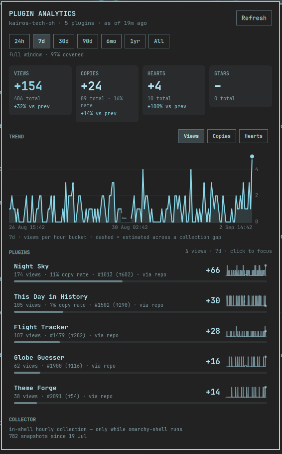

# Plugin Analytics

Developer analytics for the plugins you publish on the Omarchy marketplace.

The marketplace APIs report cumulative totals as of *now* and keep no history. This
plugin polls them hourly, keeps a small local time series, and turns it into what
a plugin author actually wants to know: how each plugin is doing over 24h, 7d, 30d,
90d, 6mo, 1yr and all-time — views, copies, hearts, GitHub stars, rank, copy rate,
and share of your total — with honest labelling of how much of each window is
backed by real data.



*Preview rendered from a demo dataset (`tools/demo-data.py`) so the trend is
visible. Your own history starts the moment the plugin is installed.*

## What you get

- **Bar label** — the delta for one metric over 24h or 7d (`▲ 128`), with a
  per-plugin tooltip. Middle-click refreshes.
- **Window picker** — 24h · 7d · 30d · 90d · 6mo · 1yr · All, with a caption that
  says exactly what the numbers cover: *full window*, *since 30 Aug*, *82% covered*.
- **Stat tiles** — views, copies, hearts, stars: the window delta as the headline,
  the cumulative total underneath, and the change against the previous equal
  period when — and only when — that comparison is honest.
- **Trend chart** — the chosen metric per bucket across the window, with a
  crosshair and tooltip. Buckets that fall inside a collection gap are drawn
  dashed and unfilled: an estimate, never a zero pretending to be a measurement.
- **Per-plugin breakdown** — sorted by delta, with a sparkline, share-of-total bar,
  copy rate, marketplace rank by views and rank movement. Click a row to overlay
  that plugin on the chart.
- **Collector status** — what is collecting, how many snapshots exist since when,
  and the last error if any.

## Install

```
omarchy plugin add https://github.com/kairos-tech-oh/omarchy-plugin-analytics --enable
```

Then add **Plugin Analytics** to your bar from the shell's bar settings, open it,
and enter your author. The plugin accepts either spelling the catalog uses:

- the `author` display name on your listings (e.g. `kairos`), or
- the GitHub owner from your repository URLs (e.g. `kairos-tech-oh`).

Both match exactly and case-insensitively. If nothing matches you get a clear
error rather than an empty dashboard. Where one display name spans several
GitHub owners (the catalog has a few), every matched row says which field matched.

The first snapshot is taken immediately. From then on the plugin collects **once
an hour while omarchy-shell is running**. That is enough for most people.

### Optional: collect even when the shell is not running

Hours when you are logged out or the shell is down are permanent holes in your
history, because the APIs cannot be asked about the past. A user-level systemd
timer closes those holes: it runs the same collector hourly, independently of the
shell, and catches up one missed run after boot.

Run once in a terminal — user scope only, nothing privileged:

```
mkdir -p ~/.config/systemd/user
cp ~/.config/omarchy/plugins/kairos.plugin-analytics/systemd/* ~/.config/systemd/user/
systemctl --user daemon-reload
systemctl --user enable --now kairos-plugin-analytics.timer
```

The panel shows these commands with a copy button; it never runs them itself.
When the timer is active the in-shell collector stands down, so the two never race.

## Remove

```
systemctl --user disable --now kairos-plugin-analytics.timer   # only if you enabled it
rm -f ~/.config/systemd/user/kairos-plugin-analytics.{service,timer}
systemctl --user daemon-reload
omarchy plugin remove kairos.plugin-analytics
```

Your collected history is **retained** at `~/.local/state/kairos.plugin-analytics/`
so a reinstall picks up where it left off. Delete that directory to remove it.

## How it works

```
systemd --user timer (optional)  ─┐
                                  ├─> helper/collect.py ──> ~/.local/state/kairos.plugin-analytics/
in-shell hourly timer            ─┘        (short-lived)          hourly.jsonl   35 days of hourly rows
                                                                  daily.jsonl    older rows, one per UTC day
omarchy-shell ─> BarWidget ─> Panel ─> bounded read ──────────>   summary.json   what the panel shows
                                    ─> collect.py series ─────>   (chart buckets on demand)
```

The collector is a short-lived Python process. It fetches both APIs, reduces them
to your plugins, appends one compact row, rolls up anything older than 35 days
into daily rows, and rewrites a small `summary.json`. The shell only ever reads
that summary through a bounded read; the 5 MB catalog never enters the shell.

### The APIs

| Endpoint | Cadence | Notes |
|---|---|---|
| `https://api.omarchyplugins.com/v1/stats` | hourly | 137 KB; views, copies, hearts for every plugin. Rank is computed from this. |
| `https://plugins.omarchy.org/catalog.json` | hourly, conditional | 5.3 MB, but served with an `ETag`; unchanged catalogs cost one `304` round trip and no body. Provides author resolution and GitHub stars. |

Requests are HTTPS-only to a fixed allowlist, pinned to a freshly validated
address, refuse redirects, carry a whole-request deadline and a byte cap, and
identify themselves with a descriptive User-Agent. A blocked or failed fetch keeps
the previous state rather than inventing a new one.

### The maths, and why it is not the obvious version

The metrics are cumulative counters sampled irregularly. The naive
`value_now − value_then` is wrong in ways that produce plausible numbers, so:

- **Gaps are prorated.** A laptop that sleeps overnight sees +600 across a 72-hour
  gap. Attributing that to the last hour would show +600 in "last 24h"; the plugin
  spreads it across the gap and marks the affected buckets as estimated.
- **Negative steps are kept, not clamped.** A downward correction upstream lands
  in a visible adjustment; only a collapse to near-zero counts as a counter reset
  (which contributes nothing and is listed).
- **Absent is not zero.** A plugin missing from a payload is "not observed", never
  0 — so a delisted-and-relisted plugin cannot book a phantom gain.
- **Windows are anchored to the last snapshot**, half-open, and exactly adjacent to
  their previous period, so nothing is counted twice and "vs previous" compares
  equal durations. The comparison is suppressed when the previous period is
  insufficiently covered.
- **Coverage is measured in seconds**, per plugin, so timer jitter and catch-up
  runs do not corrupt it.
- **Hearts and stars are signed.** People un-heart and un-star; those deltas can
  legitimately be negative and are shown that way. Stars are sparse and are never
  prorated.
- **Rollup is lossless for everything shown.** Daily rows store the day's gross,
  adjustments, resets and coverage computed from the hourly rows, so a 90-day
  query returns the same answer before and after a day crosses the 35-day
  boundary.

`tools/check-math.py` asserts all of this against synthetic histories with
resets, corrections, multi-day gaps, missing plugins and a rollup boundary.

## Settings

| Key | Values | Meaning |
|---|---|---|
| `author` | text | Author name or GitHub owner, matched exactly |
| `barMetric` | `views` `copies` `hearts` | Which delta the bar label shows |
| `barWindow` | `24h` `7d` | Window for the bar label |
| `defaultWindow` | `24h` … `all` | Window the panel opens on |

All are editable from the shell's bar settings; the author is also editable in
the panel.

## IPC

```
omarchy-shell shell toggle kairos.plugin-analytics
omarchy-shell shell summon kairos.plugin-analytics
qs -c omarchy ipc call kairos.plugin-analytics refresh
```

## Storage

`~/.local/state/kairos.plugin-analytics/` (or `$XDG_STATE_HOME`), created `0700`:

| File | Purpose | Size |
|---|---|---|
| `hourly.jsonl` | one row per snapshot, 35-day retention | ~250 KB for 5 plugins |
| `daily.jsonl` | rolled-up days, kept forever | ~250 KB per year |
| `catalog.jsonl` | star observations on the catalog's cadence | small |
| `resolved.json` | author → plugin mapping and which field matched | small |
| `summary.json` | everything the panel shows | ~35 KB for 5 plugins |
| `meta.json` | ETag, last run, rollup seam | tiny |

Up to 50 plugins are tracked per author. Nothing leaves your machine except the
two API requests above; no credentials are involved anywhere.

## Dependencies

`python3`, `curl`, coreutils (`dd`, `timeout`) — all present on Omarchy. `wl-copy`
is used only by the *Copy commands* button.

## Development

```
tools/run-checks.sh          # compile, maths fixtures, manifest, preflight
tools/demo-data.py 45        # synthetic 45-day history into the state dir (dev only)
helper/collect.py rebuild    # recompute summary.json from stored rows, no network
```

## License

MIT
